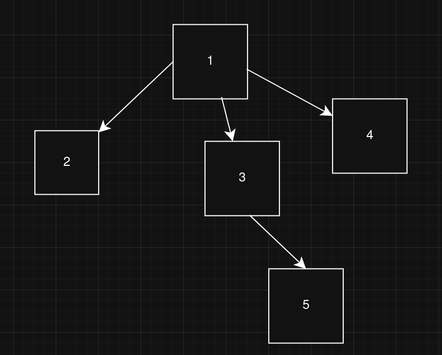
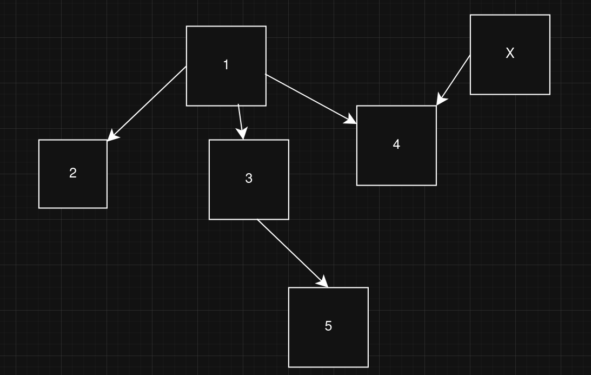
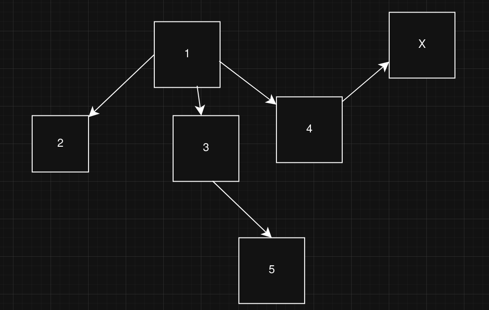

# Examen-Sustitutorio-DS
Examen sustitutorio Desarrollo de Software 2025-1

Zapata Inga, Janio

# Grafo Terraform Composite + Adapter

- Se recorre recursivamente los archivos de terraform , son parseados en formato json, y añadidos a una lista.

- Se utiliza el patrón composite para representar la jerarquía de la estructura de Terraform. Similar a un árbol, `TerraformComponent`represente un nodo, mientras que `TerraformLeaf` representa una hoja.

-  También se añadió un test para `composite`, verificando la correcta creación del árbol 

- `TerraformDependencyAdapter` nos permite obtener aristas (get_edges) y metadatos (Grado del vertice) sin importar que los nodos sean de diferentes tipos (resource,variable,output,etc)

## Pregunta teórica: 
*Explica cómo la incorporación de un nuevo tipo de bloque de Terraform se integra sin modificar la lógica de orden topológico, señalando cómo se mantiene OCP.*

- Siguiendo con la analogía del árbol, si quisieramos añadir un nuevo componente (una nueva hoja), bastaría con agregar una arista al árbol. Esto quiere decir, que no estamos modificando la estructura interna del árbol en sí (está se mantiene, solo que ahora vendría a ser un subgrafo) , solamente le estamos añadiendo una "extensión" (Principio OCP)

- Ahora con respecto al orden topológico, este representa cómo dependen los componentes entre sí. 

`[Componente1, Componente2]`
Componente 2 depende de 1
En el grafo 2 -> 1

- Supongamos que necesitamos insertamos un nuevo módulo. Esto quiere decir que dentro de los componentes iniciales, hay uno que tendrá una nueva "dependencia". O también que este nuevo módulo dependerá de alguno de los inciiales. Por lo tanto, la lógica de orden topológico se mantendrá (esta es una propiedad de los grafos acíclicos dirigidos)  

Sea el grafo siguiente, donde cada nodo representa un módulo. Un orden topológico sería [[1,2],[1,3],[1,4],[3,5]]

Añadiendo un nuevo módulo
- Caso 1
    
    Un orden topológico sería [[1,2],[1,3],[3,5],[1,4],**[x,4]**]

    
    Un orden topológico sería [[1,2],[1,3],[1,4],[3,5],**[4,x]**]

En el contexto de Iac resulta intuitivo, **no se puede iniciar un módulo sin antes haber iniciado sus dependencias (si (u, v) ∈ E, v nunca aparece antes de u en la secuencia)**